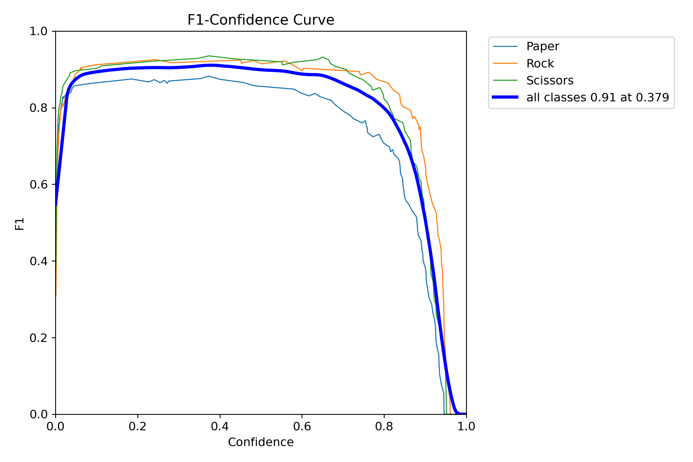
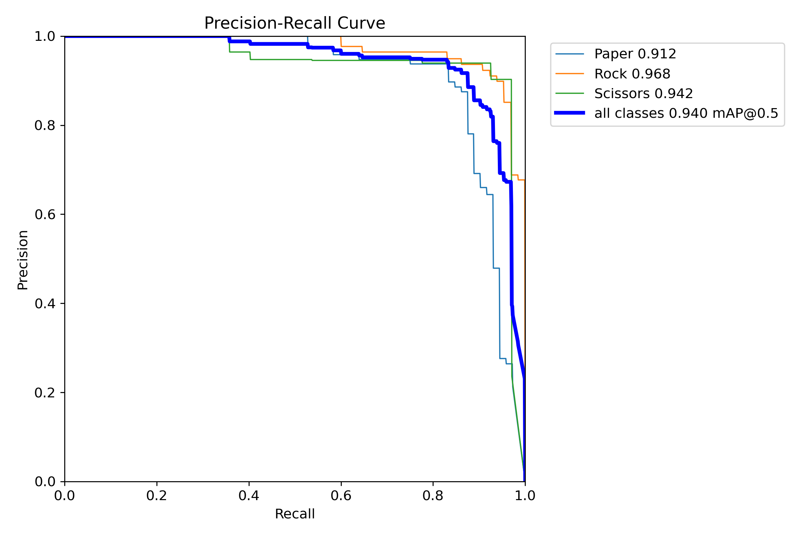
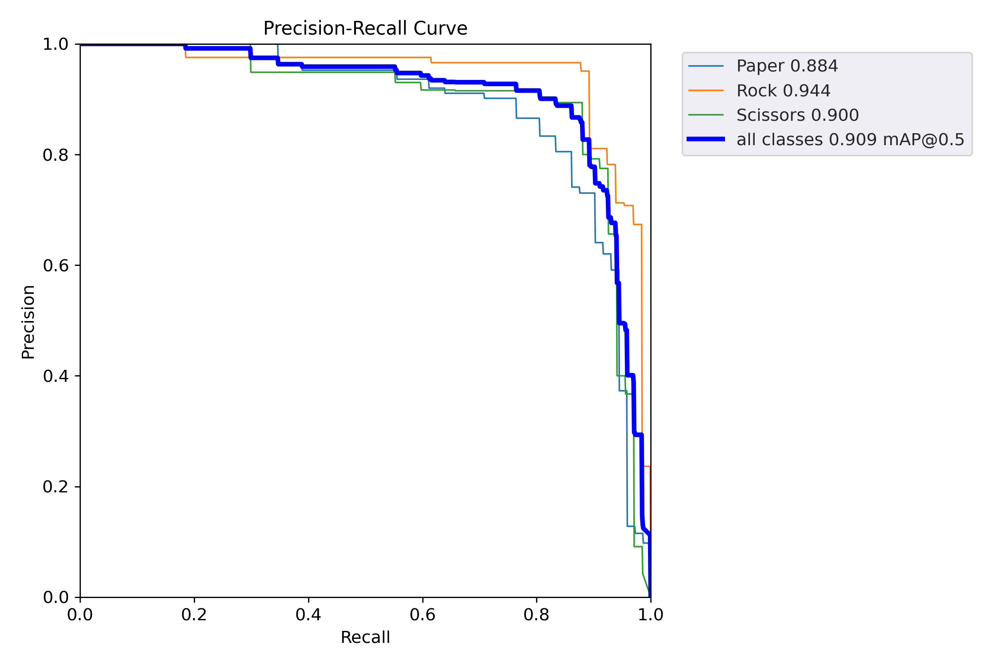

# YOLOv5 Model training on Rock, Paper, Scissor dataset from Roboflow Universe.

action result: 
- trained model on custom parametrized augmentation train dataset
- trained model on train dataset
- compared two models by predicting on test dataset
## results summary

| Metric | Original Model | Augmented Model |
|--------|----------------|-----------------|
| Precision | 0.94 | 0.88 |
| Recall | 0.94 | 0.86 |
| mAP@0.5 | 0.96 | 0.91 |
| mAP@0.5:0.95 | 0.74 | 0.59 |
 

## PR & F1 Curve Comparison

### Original Model
#### F1 Curve:

#### PR Curve:


---

### Augmented Model
#### PR Curve:


#### F1 Curve:


## conclusion
The model trained on original dataset showed better result, its max mAPe is around 0.96 (see results.csv file), and for the model trained on augmented dataset is around 0.91. The reason for such difference between the models' perfomances is my custom parametrized augmentation was too much, I chose rapid augmentation such as bluring is 0.3, rotation degree is 120 degrees, therefore such augmentation to the train dataset caused change in distribution in original set. 

##  how to run
original dataset:

```bash
python3 train.py --data /home/nurbanu/roverTask/dataset/data.yaml --cfg models/yolov5s.yaml --weights yolov5s.pt --batch-size 128 --epochs 30 --device 0
```

augmented dataset:
```bash
python3 train.py --data /home/nurbanu/roverTask/dataset/data_aug.yaml --cfg models/yolov5s.yaml --weights yolov5s.pt --batch-size 128 --epochs 30 --device 0
```

change the directory of data.yaml and data_aug.yaml accordingly
