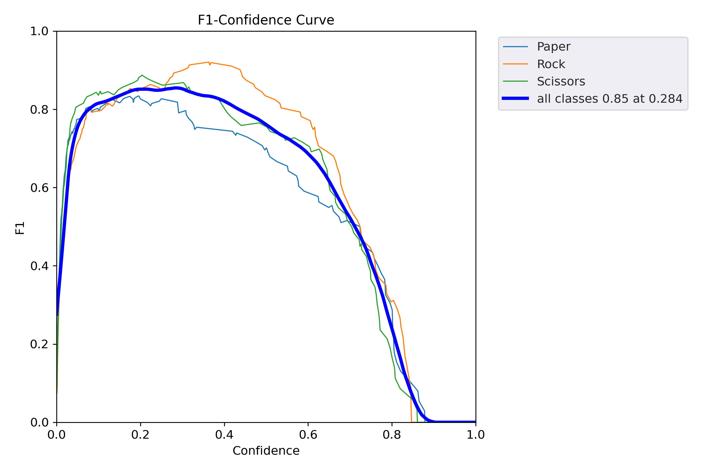

# YOLOv5 Model training on Rock, Paper, Scissor dataset from Roboflow Universe.

what I did:
- made custom parametrised augmentation for train dataset.
- trained model on custom parametrized augmentation train dataset
- trained model on original train dataset
- compared two models by predicting on test dataset

## Results Summary

| Metric | Original Model | Augmented Model |
|--------|----------------|-----------------|
| Precision | 0.94 | 0.88 |
| Recall | 0.94 | 0.86 |
| mAP@0.5 | 0.96 | 0.91 |
| mAP@0.5:0.95 | 0.74 | 0.59 |
 

## PR & F1 Curve Comparison

### Original Model
#### F1 Curve:

#### PR Curve:


---

### Augmented Model
#### PR Curve:


#### F1 Curve:


## Conclusion
The model trained on original dataset showed better result, its max mAP@0.5 is around 0.96 (see results.csv file), and for the model trained on augmented dataset is around 0.91. The reason for such difference between the models' perfomances is my custom parametrized augmentation was too much, I chose agressive augmentation such as bluring is 0.3, rotation degree is 120 degrees, therefore such augmentation to the train dataset caused change in distribution in original set. Additionally, decrease in recall and precision for the augmented model indicates that the model is making more false positives and false negatives. 

#### Some examples of augmented data
![Augmented Images] (yolov5/runs/train/aug2/train_batch1.jpg)
(yolov5/runs/train/aug2/train_batch2.jpg)


- Batch Size: 128
- Epochs: 30
- Learning Rate: default
- Optimizer: default
- Image Size: default

##  How to run
original dataset:

```bash
python3 train.py --data /home/nurbanu/roverTask/dataset/data.yaml --cfg models/yolov5s.yaml --weights yolov5s.pt --batch-size 128 --epochs 30 --device 0
```

augmented dataset:
```bash
python3 train.py --data /home/nurbanu/roverTask/dataset/data_aug.yaml --cfg models/yolov5s.yaml --weights yolov5s.pt --batch-size 128 --epochs 30 --device 0
```

change the directory of data.yaml and data_aug.yaml accordingly to your local path.
